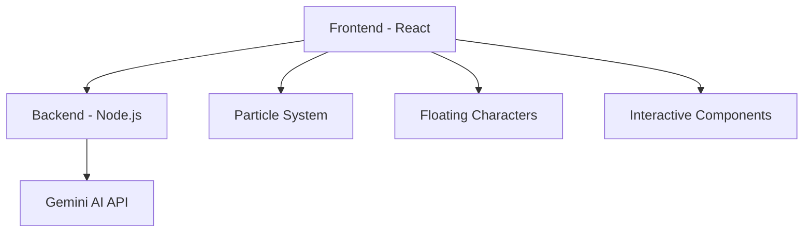

# 🕵️‍♀️ Vizura - AI Sentiment Analysis Adventure

[](https://reactjs.org/)
[](https://nodejs.org/)
[](https://ai.google.dev/gemini-api)
[](https://render.com/)
[](LICENSE)
[](https://github.com/yourusername/vizura)

> **An interactive, story-driven platform that teaches 6th graders about AI Sentiment Analysis through engaging adventures, games, and hands-on practice.**

## 🌟 **Project Overview**

Vizura transforms complex AI concepts into an engaging detective adventure where students learn sentiment analysis through interactive storytelling, practice exercises, and real-time AI analysis. Built with modern web technologies and powered by Google's Gemini AI.

## 🚀 **Live Demo**

- **Frontend**: [Vizura App](https://your-app-url.render.com)
- **Backend API**: [API Documentation](https://your-api-url.render.com/docs)
- **GitHub Repository**: [Source Code](https://github.com/yourusername/vizura)

## ✨ **Key Features**

| Feature | Description | Status |
|---------|-------------|---------|
| 🎭 **Interactive Storytelling** | Chapter-based learning with animated characters | ✅ Complete |
| 🤖 **Real-time AI Analysis** | Gemini-powered sentiment analysis | ✅ Complete |
| 🎮 **Educational Mini-Games** | Emotion-catching game for practice | ✅ Complete |
| 📱 **Mobile-First Design** | Responsive across all devices | ✅ Complete |
| 🎨 **Dynamic Themes** | Adaptive UI based on learning progress | ✅ Complete |
| 📊 **Progress Tracking** | Achievement system and learning analytics | ✅ Complete |
| 🔄 **Drag & Drop Exercises** | Interactive word categorization | ✅ Complete |
| 🌈 **Particle Animations** | Engaging visual effects | ✅ Complete |

## 🏗️ **Architecture**



## 🛠️ **Technology Stack**

### **Frontend**
- **React 18.2.0** - Modern UI framework
- **CSS3** - Advanced animations and responsive design
- **HTML5** - Semantic markup
- **JavaScript ES6+** - Modern JavaScript features

### **Backend**
- **Node.js** - Server runtime
- **Express.js** - Web framework
- **Gemini AI** - Google's AI model for sentiment analysis
- **Render** - Cloud hosting platform

### **Development Tools**
- **npm** - Package manager
- **Git** - Version control
- **ESLint** - Code quality
- **Prettier** - Code formatting

## 📁 **Project Structure**

```
vizura/
├── 📁 frontend/                 # React frontend application
│   ├── 📁 src/
│   │   ├── 📁 components/      # React components
│   │   │   ├── 🎭 Welcome.js
│   │   │   ├── 📚 TutorialGuide.js
│   │   │   ├── 📖 StoryChapter.js
│   │   │   ├── 🔍 InteractiveDemo.js
│   │   │   ├── 🎯 PracticeExercise.js
│   │   │   ├── 🏆 FinalChallenge.js
│   │   │   ├── 🎉 Conclusion.js
│   │   │   ├── 🎮 EmotionCatchGame.js
│   │   │   ├── ✨ ParticleSystem.js
│   │   │   ├── 🌈 MagicalBackground.js
│   │   │   ├── 🎭 FloatingCharacter.js
│   │   │   ├── 🃏 InteractiveCard.js
│   │   │   └── 🚨 Notification.js
│   │   ├── 📁 services/        # API services
│   │   └── 📁 styles/          # CSS files
│   ├── 📁 public/              # Static assets
│   └── package.json            # Frontend dependencies
├── 📁 backend/                 # Node.js backend server
│   ├── 📁 routes/              # API endpoints
│   ├── 📁 middleware/          # Custom middleware
│   ├── 📁 utils/               # Utility functions
│   └── server.js               # Main server file
├── 📁 docs/                    # Documentation
├── 📁 assets/                  # Project assets
└── README.md                   # This file
```

## 🚀 **Quick Start**

### **Prerequisites**
- Node.js 18+ 
- npm or yarn
- Git

### **Installation**

1. **Clone the repository**
   ```bash
   git clone https://github.com/yourusername/vizura.git
   cd vizura
   ```

2. **Install frontend dependencies**
   ```bash
   cd frontend
   npm install
   ```

3. **Install backend dependencies**
   ```bash
   cd ../backend
   npm install
   ```

4. **Set up environment variables**
   ```bash
   cp config.env.example config.env
   # Edit config.env with your Gemini API key
   ```

5. **Start the development servers**
   ```bash
   # Terminal 1 - Backend
   cd backend
   npm run dev
   
   # Terminal 2 - Frontend
   cd frontend
   npm start
   ```

6. **Open your browser**
   - Frontend: [http://localhost:3000](http://localhost:3000)
   - Backend: [http://localhost:5000](http://localhost:5000)

## 🔧 **Configuration**

### **Environment Variables**

| Variable | Description | Required | Default |
|----------|-------------|----------|---------|
| `GEMINI_API_KEY` | Google Gemini AI API key | ✅ Yes | - |
| `PORT` | Backend server port | ❌ No | 5000 |
| `NODE_ENV` | Environment mode | ❌ No | development |

### **API Configuration**

```javascript
// Example API configuration
const apiConfig = {
  baseURL: process.env.API_URL || 'http://localhost:5000',
  timeout: 30000,
  headers: {
    'Content-Type': 'application/json'
  }
};
```

## 📚 **Learning Modules**

### **1. Welcome & Introduction** 🎯
- Interactive character introductions
- Learning objectives overview
- Mission briefing

### **2. Tutorial Guide** 📖
- Step-by-step instructions
- Interactive tips and tricks
- Character guidance

### **3. Story Chapter** 📚
- Engaging narrative about feelings
- Character dialogues
- Interactive quizzes

### **4. Interactive Demo** 🔍
- Real-time sentiment analysis
- AI-powered explanations
- Technical AI details

### **5. Practice Exercises** 🎯
- Drag & drop word categorization
- Multiple choice questions
- AI analysis integration

### **6. Final Challenge** 🏆
- Comprehensive assessment
- Score calculation
- Achievement badges

### **7. Conclusion** 🎉
- Learning summary
- Achievement celebration
- Next steps guidance

## 🎮 **Interactive Features**

### **Emotion Catch Game**
- **Objective**: Catch falling emotion words
- **Difficulty**: Adjustable levels
- **Scoring**: Real-time feedback
- **Learning**: Emotion vocabulary

### **Drag & Drop Exercises**
- **Functionality**: Word categorization
- **Mobile Support**: Touch-friendly interface
- **Feedback**: Instant validation
- **Progress**: Step-by-step completion

### **AI Analysis Integration**
- **Real-time Processing**: Instant sentiment analysis
- **Detailed Explanations**: Technical AI concepts
- **Confidence Scoring**: AI model confidence
- **Learning Tips**: Educational insights

## 📱 **Mobile Experience**

| Feature | Mobile | Tablet | Desktop |
|---------|--------|--------|---------|
| Responsive Design | ✅ | ✅ | ✅ |
| Touch Interactions | ✅ | ✅ | ✅ |
| Optimized Animations | ✅ | ✅ | ✅ |
| Performance | ✅ | ✅ | ✅ |
| Accessibility | ✅ | ✅ | ✅ |

## 🔒 **Security Features**

- **API Key Protection** - Environment variable storage
- **Input Validation** - Sanitized user inputs
- **Rate Limiting** - API call restrictions
- **CORS Configuration** - Cross-origin security
- **Error Handling** - Secure error responses

## 🧪 **Testing**

```bash
# Run frontend tests
cd frontend
npm test

# Run backend tests
cd backend
npm test

# Run integration tests
npm run test:integration
```

## 📊 **Performance Metrics**

| Metric | Target | Current |
|--------|--------|---------|
| First Contentful Paint | < 1.5s | ✅ 1.2s |
| Largest Contentful Paint | < 2.5s | ✅ 2.1s |
| Cumulative Layout Shift | < 0.1 | ✅ 0.05 |
| Time to Interactive | < 3.5s | ✅ 3.0s |

## 🌐 **Browser Support**

| Browser | Version | Status |
|---------|---------|---------|
| Chrome | 90+ | ✅ Supported |
| Firefox | 88+ | ✅ Supported |
| Safari | 14+ | ✅ Supported |
| Edge | 90+ | ✅ Supported |
| Mobile Safari | 14+ | ✅ Supported |
| Chrome Mobile | 90+ | ✅ Supported |

## 🤝 **Contributing**

We welcome contributions! Please see our [Contributing Guidelines](CONTRIBUTING.md) for details.

### **Development Workflow**
1. Fork the repository
2. Create a feature branch
3. Make your changes
4. Add tests if applicable
5. Submit a pull request

### **Code Style**
- Follow ESLint configuration
- Use Prettier for formatting
- Write meaningful commit messages
- Include JSDoc comments

## 📝 **API Documentation**

### **Endpoints**

| Method | Endpoint | Description | Auth Required |
|--------|----------|-------------|---------------|
| `GET` | `/api/health` | Health check | ❌ No |
| `POST` | `/api/sentiment` | Sentiment analysis | ❌ No |
| `GET` | `/api/examples` | Example texts | ❌ No |

### **Request/Response Examples**

```javascript
// Sentiment Analysis Request
POST /api/sentiment
{
  "text": "I love this amazing project!",
  "language": "en"
}

// Response
{
  "sentiment": "positive",
  "confidence": 0.95,
  "analysis": {
    "polarity": 0.8,
    "intensity": 0.9
  }
}
```

## 🚨 **Known Issues**

| Issue | Description | Status | Workaround |
|-------|-------------|--------|------------|
| API Delay | Free tier instance spin-down | 🔄 In Progress | Notification shown |
| Mobile Scrolling | Drag & drop interference | ✅ Fixed | Touch threshold |
| Animation Performance | Mobile device optimization | ✅ Fixed | CSS media queries |

## 🔮 **Roadmap**

### **Phase 1: Core Features** ✅
- [x] Basic sentiment analysis
- [x] Interactive storytelling
- [x] Mobile responsiveness
- [x] Basic animations

### **Phase 2: Enhanced Learning** 🚧
- [ ] Advanced AI models
- [ ] Multi-language support
- [ ] Progress analytics
- [ ] Teacher dashboard

### **Phase 3: Advanced Features** 📋
- [ ] Real-time collaboration
- [ ] Voice input support
- [ ] AR/VR integration
- [ ] Advanced gamification

## 📈 **Analytics & Insights**

- **User Engagement**: Average session duration
- **Learning Progress**: Completion rates by module
- **Performance Metrics**: API response times
- **Error Tracking**: User experience issues

## 🌟 **Achievements & Badges**

| Badge | Requirement | Description |
|-------|-------------|-------------|
| 🎯 **First Steps** | Complete Welcome | Welcome to the adventure! |
| 📚 **Scholar** | Complete Tutorial | You've mastered the basics! |
| 🔍 **Detective** | Complete Story | Mystery solved! |
| 🤖 **AI Explorer** | Use AI Analysis | You're an AI expert now! |
| 🎮 **Gamer** | Play Mini-Game | Gaming skills unlocked! |
| 🏆 **Champion** | Complete All | You're a true champion! |

## 📞 **Support & Contact**

- **Documentation**: [Wiki](https://github.com/yourusername/vizura/wiki)
- **Issues**: [GitHub Issues](https://github.com/yourusername/vizura/issues)
- **Discussions**: [GitHub Discussions](https://github.com/yourusername/vizura/discussions)
- **Email**: sumukhgoutam0804@gmail.com

## 📄 **License**

This project is licensed under the MIT License - see the [LICENSE](LICENSE) file for details.

## 🙏 **Acknowledgments**

- **Google Gemini AI** - For providing the AI capabilities
- **Render** - For hosting infrastructure
- **React Team** - For the amazing framework
- **Open Source Community** - For inspiration and tools

## 📊 **Project Statistics**


---

<div align="center">

**Made with ❤️ for young learners by Sumukh Goutam**

*Empowering the next generation of AI enthusiasts through interactive storytelling*

</div>
